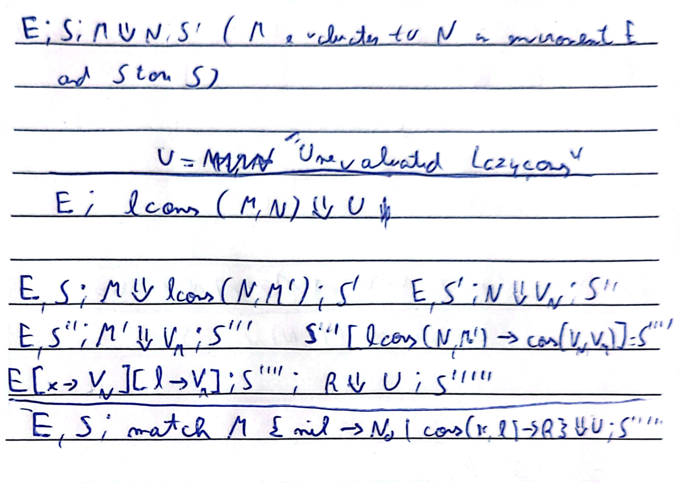

# LPro-P1 - 103652

## Overview

This is the report referring to Phase 1 of the Programming Languages course for Instituto Superior Técnico

---

## Big Step Evaluation Rules for LCons

When an LCons has yet to be evaluated through a Match operation, its toStr() method will simply return "Unevaluated LazyCons". Upon the application of a Match operation on a Lazy List, its head and tail are evaluated. These values are then stored and the LazyList is stored as a Strict List Equivalent, thus having its tail and head values properly stored and available for printing as well as any other operations.

---

## LCons Definition in Code

[See the LCons implementation in 'VLazyCons.java'](Project/VLazyCons.java)  
[See the LCons implementation in 'ASTCons.java'](Project/ASTCons.java)  
[See the LCons implementation in 'ASTMatch.java'](Project/ASTMatch.java)  

The original strict lists were implemented in [VCons.java](Project/VCons.java). In order to implement the lazy lists, this was used as a basis. Within ASTCons, a new boolean "isLazy" was created, that defines wether the given list is lazy or not. When this boolean is true, a VLazyCons is created, skipping the evaluation of the head and tail and passing the nodes directly as arguments.  
Within the VLazyCons class, a similar boolean was created named "evaluated". From the moment a lazy list is created until the point when it is evaluated through a Match operation, this boolean remains false, and the "headValue" and "tailValue" variables are kept as NULL, indicating the lazy list has yet to be analyzed. Once a Match operation is performed, an exclusive method named force() is executed, forcing the evaluation of the head and tail nodes to their respective IValues. A new Strict List Node is not created, but the values of the head and tail are stored within the already existing VLazyCons, and the boolean "evaluated" is changed to true, thus forward offering the same behavior as a Strict List.  
For matters of clarity, when a Lazy List has yet to be evaluated, its toStr() method return "Unevaluated LazyCons", given the fact that Nodes do not possess a toStr() method and the value of its head and tail are truly unknown to the Lazy List node. 

## Project Structure

There are 3 folders within the project:
- The [Images](/Images) folder simply contains images used in the report.
- The [Project](/Project) folder contains the entirety of the developed project, including the Environment, ASTNodes, IValues, Parser, Token and Error definition. For matters of clarity since these names may not be clear, the Assignment Operation is located in the [ASTSeqExp node](Project/ASTSeqExp.java) and the Dereferencing Operation is located in the [Star Node](Project/ASTStar.java).
-  The [Tests](/Tests) folder contain 4 files. The three whose name start with tests ([tests](Tests/tests.md), [testL1](Tests/testsL1.md) and [testsL1++](Tests/testsL1++.md)) refer to tests offered by the professor, with some slight alterations due to syntax problems. [newTests.md](Tests/newTests.md) contains the 5 new tests that were developed by my person. They test, respectively:
   - The annexation of a matched lazy list to a strict list;
   - The effect on a lazy list of analyzing and altering all its individual values;
   - The filtering of a lazy list according to a specific condition; 
   - The creation of a nested lazy list as opposed to the value by value approach;
   - The behaviour of a lazy list when faced with nested match operations;

---

## Usage

In order to compile and test the project the following steps should be taken:
- Starting at the base folder of the project, execute the instruction `cd Project`
- Then, execute the instructions `chmod +x makeit.sh breakit.sh`
- Now that the permisions have been granted, the program may be compiled with `./makeit.sh`
- Finally, the program may be executed with `java L0int`  
- If, for matters of compression, you wish to decompile the code and delete all the .class files, yoy may execute the instruction `./breakit.sh`

### Project executed by André Noronha, ist1103652 